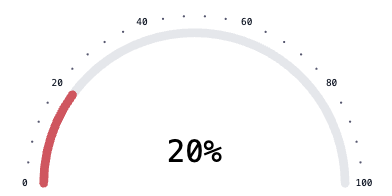

# Semi Circle Progress Bar React

A lightweight and customizable **semi-circular progress bar React component** built with **React + TypeScript**.  
Ideal for dashboards, analytics, and any UI where you need to visualize percentage-based progress.

<p align="center">
  
</p>

---

## ✨ Features

- Semi-circular (180°) progress bar
- Fully customizable via props
- Smooth SVG-based rendering
- Written in TypeScript
- Easy to integrate with React / Vite / Next.js

---

## 📦 Installation

Using npm:

```bash
npm install semi-circle-progress-bar-react
```

Using yarn:

```bash
yarn add semi-circle-progress-bar-react
```

---

## 🚀 Usage

### Basic Example

```tsx
import SemiCircleProgressBar from "semi-circle-progress-bar";

function App() {
  return <SemiCircleProgressBar percentage={65} />;
}

export default App;
```

---

## 🎛 Props

### `SemiCircularProgressProps`

| Prop                | Type               | Default | Description                                         |
| ------------------- | ------------------ | ------- | --------------------------------------------------- |
| `size`              | `string \| number` | `200`   | Width of the progress bar (e.g. `200` or `"12rem"`) |
| `strokeWidth`       | `number`           | `12`    | Thickness of the progress arc                       |
| `max`               | `number`           | `100`   | Maximum value for progress calculation              |
| `progress`          | `number`           | `0`     | Current progress value                              |
| `animationDuration` | `number`           | `500`   | Animation duration in milliseconds                  |
| `showPercentage`    | `boolean`          | `true`  | Toggle percentage text visibility                   |

---

### 🎨 Track

Controls the background arc.

| Prop          | Type     | Description          |
| ------------- | -------- | -------------------- |
| `track.color` | `string` | Background arc color |

```tsx
track={{ color: "#E5E7EB" }}
```

---

### 🟢 Bar

Controls the filled progress arc.

| Prop        | Type     | Description        |
| ----------- | -------- | ------------------ |
| `bar.color` | `string` | Progress arc color |

```tsx
bar={{ color: "#22c55e" }}
```

---

### 🔤 Label

Controls the main label inside the progress bar.

| Prop               | Type               | Description               |
| ------------------ | ------------------ | ------------------------- |
| `label.color`      | `string`           | Label text color          |
| `label.fontSize`   | `string \| number` | Label font size           |
| `label.padding`    | `number`           | Spacing around the label  |
| `label.steps`      | `number`           | Number of animation steps |
| `label.fontFamily` | `string`           | Font family               |

```tsx
label={{
  color: "#111827",
  fontSize: 14,
  fontFamily: "Inter",
}}
```

---

### ⚪ Dot

Controls decorative dots around the arc.

| Prop          | Type     | Description        |
| ------------- | -------- | ------------------ |
| `dot.color`   | `string` | Dot color          |
| `dot.radius`  | `number` | Dot radius         |
| `dot.padding` | `number` | Space between dots |
| `dot.count`   | `number` | Number of dots     |

```tsx
dot={{ count: 12, radius: 3 }}
```

---

### 📝 Text

Wrapper for custom text styles.

| Prop             | Type     | Description                   |
| ---------------- | -------- | ----------------------------- |
| `text.className` | `string` | Custom class for text wrapper |

```tsx
text={{ className: "font-medium" }}
```

---

### 📊 Percentage

Controls percentage text appearance.

| Prop                    | Type               | Description           |
| ----------------------- | ------------------ | --------------------- |
| `percentage.color`      | `string`           | Percentage text color |
| `percentage.fontSize`   | `string \| number` | Percentage font size  |
| `percentage.className`  | `string`           | Custom class          |
| `percentage.fontFamily` | `string`           | Font family           |

```tsx
percentage={{
  color: "#16a34a",
  fontSize: 18,
  fontFamily: "Inter",
}}
```

---

## 🧪 Example Usage

```tsx
<SemiCircleProgressBar
  size={240}
  strokeWidth={14}
  progress={75}
  animationDuration={600}
  bar={{ color: "#22c55e" }}
  track={{ color: "#e5e7eb" }}
  showPercentage
  percentage={{ fontSize: 20 }}
/>
```

---

## 📌 Example with Custom Styling

```tsx
<SemiCircleProgressBar
  percentage={80}
  size={240}
  strokeWidth={16}
  progressColor="#22c55e"
  backgroundColor="#e5e7eb"
  labelColor="#16a34a"
/>
```

---

## ⚠️ Notes

- `percentage` values outside **0–100** should be clamped by the consumer
- Component is **client-side only** (safe for Vite & Next.js `use client`)

---

## 🧪 Development

```bash
npm install
npm run dev
```

Build package:

```bash
npm run build
```

---

## 🤝 Contributing

Contributions are welcome!

1. Fork the repo
2. Create your feature branch
3. Commit your changes
4. Open a Pull Request

---

## 📄 License

MIT © Hosein Doroud
